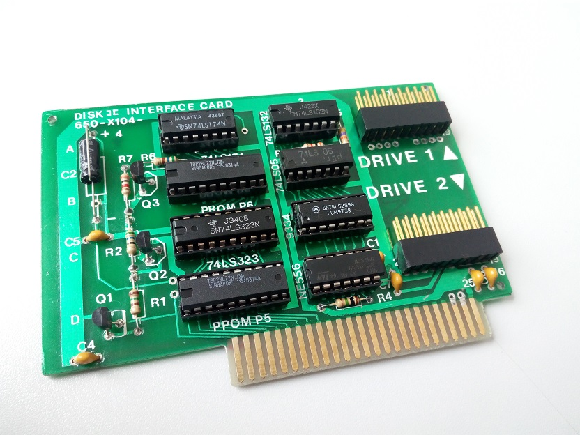
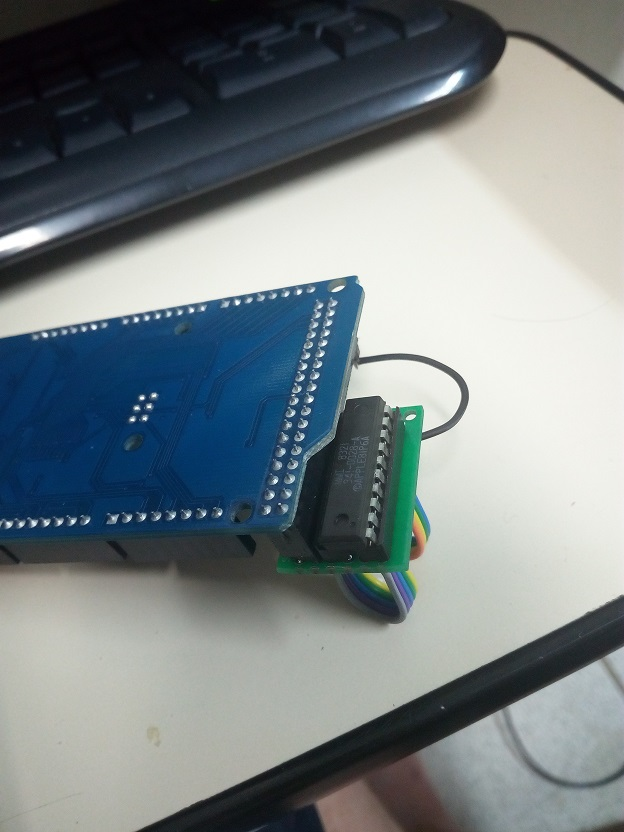
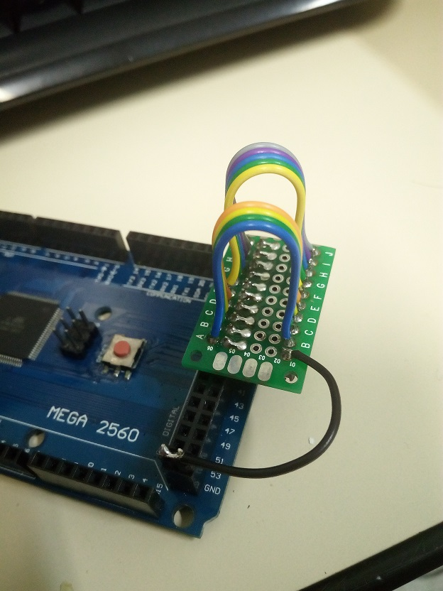
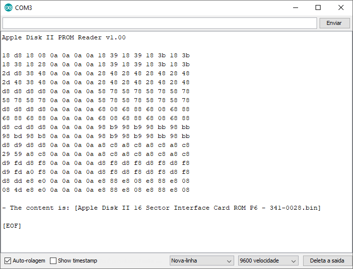
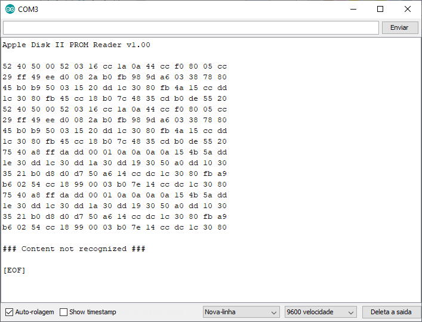

# Apple Disk II PROM Verify

For test Disk II Interface Card

<pre>
341-0009 Apple Disk II 13 Sector Interface Card ROM P5 (BOOT)
341-0010 Apple Disk II 13 Sector Interface Card ROM P6 (LOGIC)
341-0027 Apple Disk II 16 Sector Interface Card ROM P5 (BOOT)
341-0028 Apple Disk II 16 Sector Interface Card ROM P6 (LOGIC)
341-0027-A Apple Disk II 16 Sector Interface Card ROM P5A 1981 (BOOT)
342-0028-A Apple Disk II 16 Sector Interface Card ROM P6A 1981 (LOGIC)
</pre>

## Hardware requeriment:
- Arduino IDE
- Arduino Mega 2560

## Compatibility with BIPOLAR PROMs:

N82S135
MMI 6309-1
MMI 63S281
TBP18S22
TBP28L22
MB 7118
AM27S23
74S471
74LS471
uPB421

## Schema:

<pre>
------+--------------
 PROM | ARDUINO MEGA 
------+--------------
  VCC |    +5V       
  a0  |     22       
  a1  |     24       
  a2  |     26       
  a3  |     28       
  a4  |     30       
  a5  |     27       
  a6  |     25       
  a7  |     23       
  g1  |     31       
  g2  |     29       
  q0  |     32       
  q1  |     34       
  q2  |     36       
  q3  |     38       
  q4  |     39       
  q5  |     37       
  q6  |     35       
  q7  |     33       
  GND |    GND       
------+--------------
</pre>

## Board to connect PROM:

## Program check: 

### Valid PROM:

### Invalid PROM:

This is free open-source software, distributed under a very liberal license 
(the well-known MIT license). It may be used for any purpose, including 
commercial purposes, at absolutely no cost. Just download it and use it.
